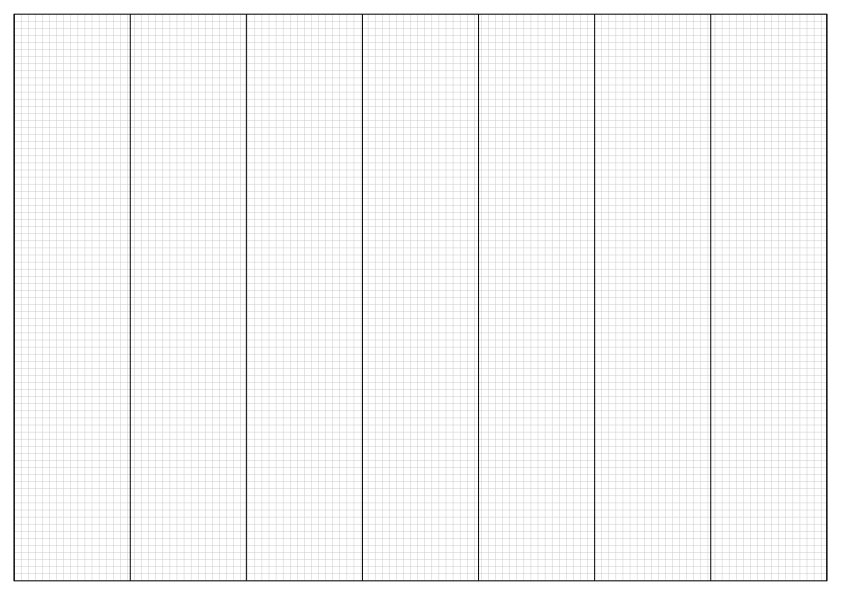

# $\mathrm{\LaTeX}$ memory Sheet

A template for creating memory sheet permitted in exams with customizable grids (for me, I wanted 0.25 cm grids)

You might want to turn off page numbers or the credits, if your printer doesn't support borderless printing.

I recommend these pens for writing on the sheet, as they are the smallest I could find (no this is not an affiliate link): <https://amzn.eu/d/hPTl6ck>

## Preview

### The template

Here is a preview of the simplistic template:

